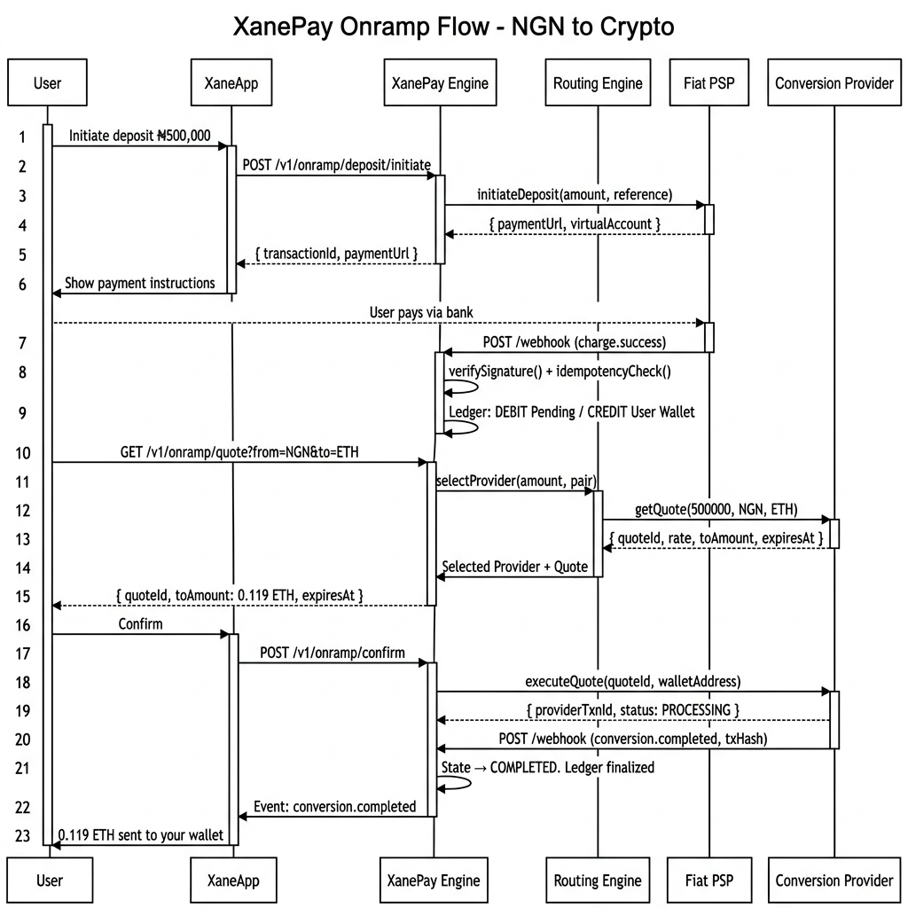

# XanePay — Onramp & Offramp Engine

> A financial orchestration engine that routes value seamlessly between fiat and crypto systems.

---

## What Is XanePay?

XanePay is the **onramp and offramp orchestration layer** within the XaneApp ecosystem.

It does not hold funds, operate as an exchange, or act as a PSP.
Instead, it sits **between the user and multiple external liquidity providers**,
routing each transaction to the best available provider based on live rates,
speed, fees, and reliability — while tracking every naira through a
double-entry accounting ledger.

```
User (XaneApp)
      ↓
  XanePay Engine          ← You are here
      ↓
Provider Abstraction Layer
      ↓
External Providers (Fiat PSPs + Conversion Providers)
      ↓
Settlement (User Bank / Crypto Wallet)
```

---

## System Architecture


---

## Core Flows

### Onramp — NGN → Crypto



### Offramp — Crypto → NGN


### Transaction State Machine


### Hexagonal Architecture


---

## Documentation

| Document | Description |
|---|---|
| [`docs/PRD.md`](./docs/PRD.md) | Full Product Requirements & Architecture Document (v3.0) |
| [`docs/ONRAMP_REQUIREMENTS.md`](./docs/ONRAMP_REQUIREMENTS.md) | Onramp engine scope, requirements, API surface & pricing |
| [`docs/OFFRAMP_REQUIREMENTS.md`](./docs/OFFRAMP_REQUIREMENTS.md) | Offramp engine scope, requirements, API surface & pricing |
| [`docs/PRICING_SUMMARY.md`](./docs/PRICING_SUMMARY.md) | Consolidated pricing for all engagement models |
| [`docs/IMPLEMENTATION_PLAN.md`](./docs/IMPLEMENTATION_PLAN.md) | Phase-by-phase delivery roadmap |

---

## Architecture Principles

- **Provider-agnostic** — no business logic tied to any specific provider
- **Hexagonal Architecture** — providers plug in as adapters; core logic never changes
- **Frontend-driven operations** — add providers, adjust routing, resolve issues from UI
- **Fail-safe transactions** — every failure path defined; money never disappears silently
- **Append-only ledger** — financial history is never mutated; balance computed from entries
- **Idempotency everywhere** — all operations safe to retry; no double-charges
- **ACID compliance** — ledger writes and state changes are always atomic
- **Observability first** — every state change logged; no server access needed to debug

---

## Key Capability: Dynamic Provider Management

Providers can be added, configured, enabled, or disabled entirely from the
operations frontend — no code changes, no redeployment, no downtime.

```
To add a new provider:
  1. Write one Adapter class implementing the relevant Port interface
  2. Register via the Admin API or operations panel
  3. Set routing weights and transaction limits
  4. Activate — live immediately
```

---

*XanePay is the orchestration engine. Not the exchange. Not the wallet. Not the PSP.*
*It is the layer that makes them all work together reliably.*
