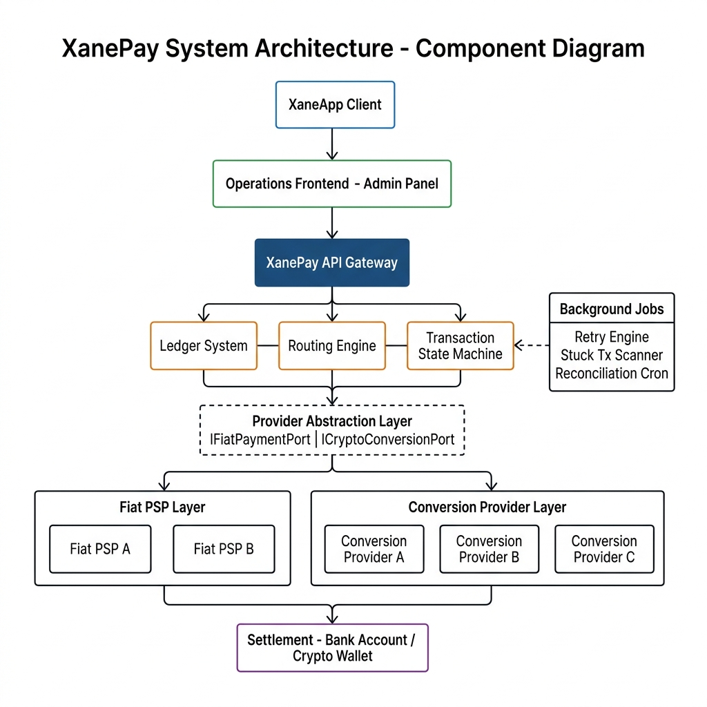
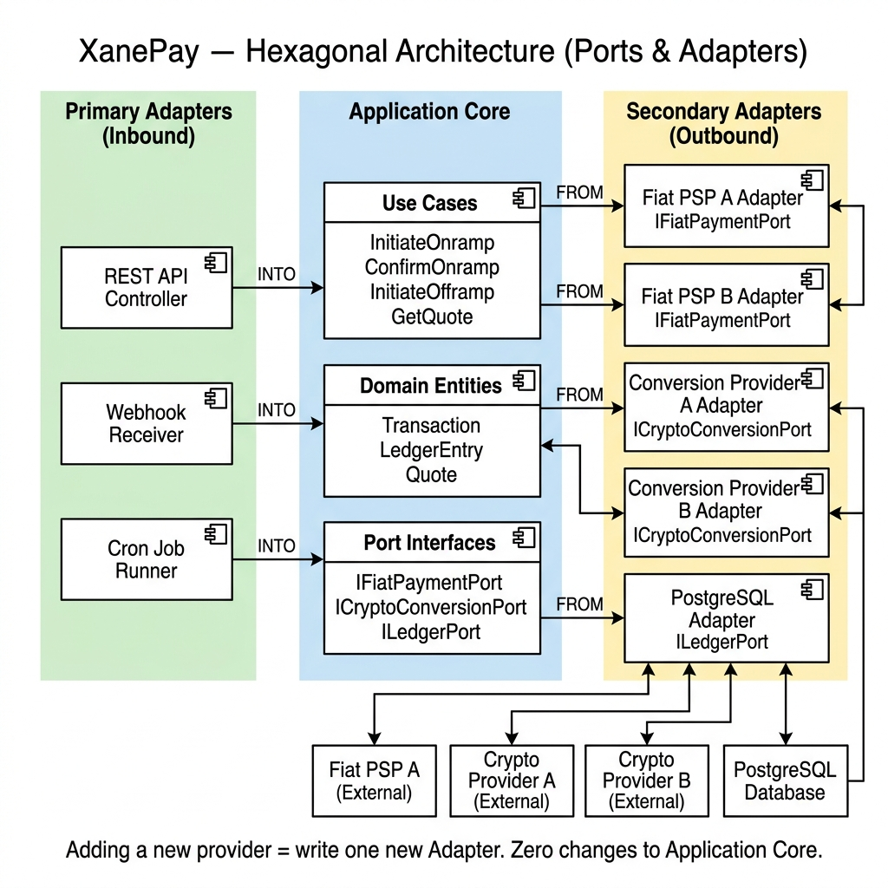
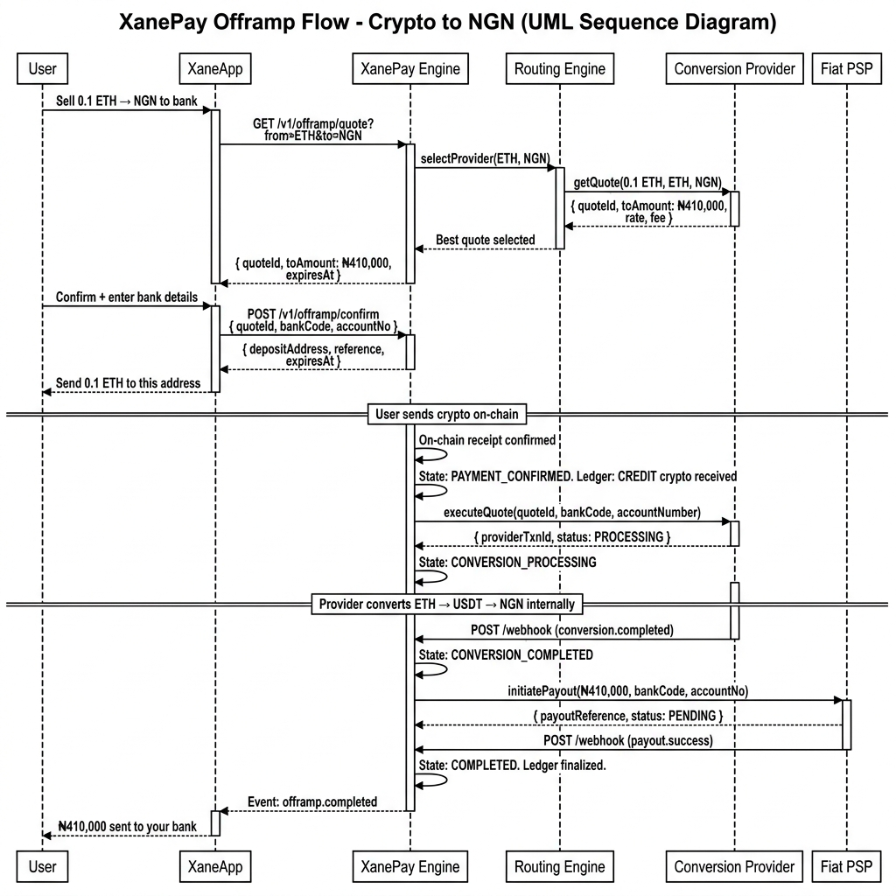
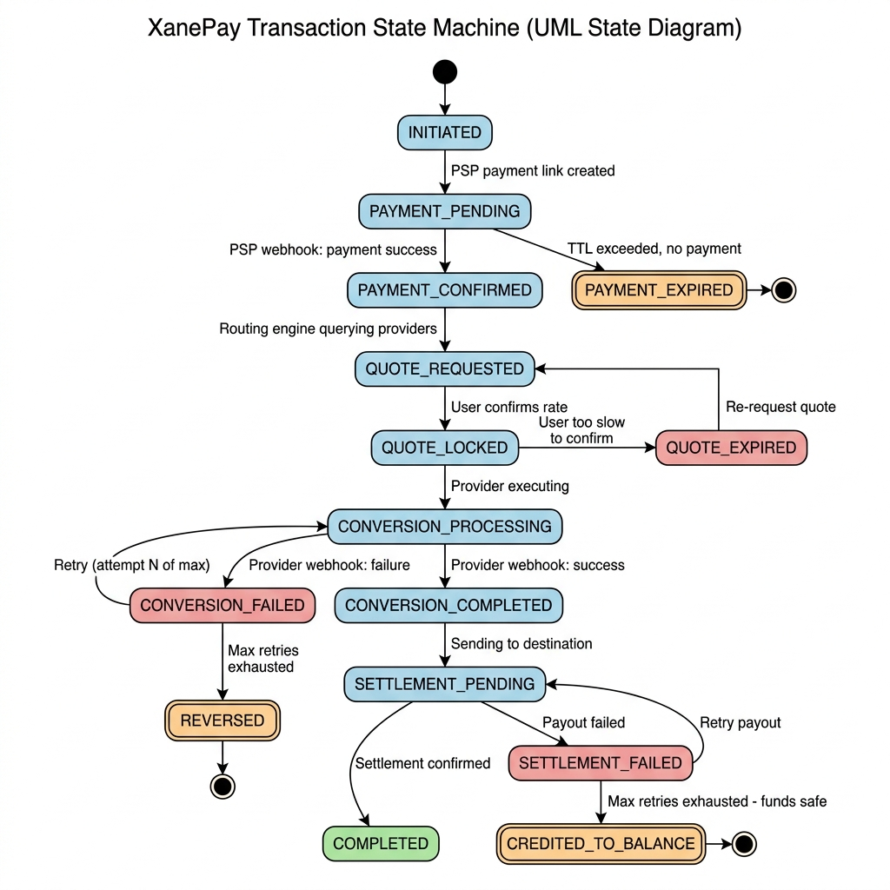

# XanePay — Offramp Engine
## Requirements, Architecture & Scope Document

> **What is the Offramp Engine?**
> The Offramp Engine handles the flow of value leaving the system —
> a user sends crypto and receives fiat (NGN) in their bank account
> or XanePay balance. It is the more complex of the two directions:
> it must monitor an on-chain deposit address, execute a crypto-to-fiat
> conversion, and then initiate a real bank payout — all while keeping
> the ledger and state machine accurate at every step.

---

## System Architecture

*The Offramp Engine uses the Conversion Provider Layer (to convert crypto
to NGN) and the Fiat PSP Layer (to pay out NGN to the user's bank).
The flow is the reverse direction of the Onramp, but the same
infrastructure — Provider Abstraction Layer, Routing Engine, Ledger,
and State Machine — is reused.*

---

## Hexagonal Architecture — Provider Independence

*Offramp providers implement the same `ICryptoConversionPort` interface
as onramp conversion providers. A single provider adapter can serve
both directions. Adding a new offramp provider requires only a new
Adapter class registered via the admin panel.*

---

## Offramp Flow — UML Sequence Diagram

*Full offramp lifecycle: from quote request and crypto deposit address
generation, through on-chain receipt confirmation, conversion execution,
and final NGN bank payout.*

---

## Transaction State Machine

*The offramp transaction follows the same enforced state machine.
The key difference is the PAYMENT_PENDING state — instead of waiting
for a bank payment, the system waits for a crypto deposit on-chain.*

---

## The Offramp Challenge — Why It Is More Complex Than Onramp

The onramp starts with a familiar action: a user pays with their phone via bank transfer.
PSPs like Paystack have well-tested webhook infrastructure for this.

The offramp starts with an **on-chain crypto send** — an action that:

- Has no single webhook provider (it is a blockchain event)
- Has variable confirmation times (seconds to minutes depending on network congestion)
- Can be sent with the wrong gas, partially, or to the wrong address
- Requires the system to watch a specific wallet address for an inbound transaction

After the crypto is received, the system must then:
- Execute a crypto-to-fiat conversion (similar to onramp, but in reverse)
- Initiate a **real bank transfer** via a PSP payout API
- Handle bank payout failures (wrong account details, bank downtime, daily limits)
- As a last resort: credit the user's XanePay balance instead of their bank

This makes the offramp responsible for **two separate async operations** with
failure modes at both steps.

---

## Offramp Functional Requirements

### FR-OFF-01 — Offramp Quote
The engine must fetch a quote from active conversion providers for a
crypto-to-fiat conversion and return the best available rate.

**Acceptance criteria:**
- All active providers queried in parallel
- Quote includes: rate, `toAmount` in NGN, fee breakdown, expiry
- Quote cached in Redis for the rate-lock window
- User must confirm before the quote expires

### FR-OFF-02 — Crypto Deposit Address Generation
On quote confirmation, the engine must provide the user with a
unique crypto deposit address to send their crypto to.

**Acceptance criteria:**
- Address is unique per transaction (prevents address reuse conflicts)
- Address and expiry recorded on the transaction
- Transaction moves to `PAYMENT_PENDING` (waiting for on-chain deposit)

### FR-OFF-03 — On-Chain Deposit Monitoring
The engine must detect when the correct amount of crypto arrives
at the user's assigned deposit address.

**Acceptance criteria:**
- Two detection strategies implemented:
  - **Primary:** Webhook from conversion provider (if supported)
  - **Fallback:** Background job polling for address balance change
- Deposit confirmed after minimum required blockchain confirmations
- Transaction moves to `PAYMENT_CONFIRMED` on detection
- Received amount validated against expected amount (slippage tolerance applied)

### FR-OFF-04 — Conversion Execution
Once crypto receipt is confirmed, the engine executes the
crypto-to-fiat conversion with the selected provider.

**Acceptance criteria:**
- Uses the locked quote (re-quotes if quote expired during wait)
- Provides destination bank details to provider at execution time
- Provider transaction ID recorded
- Transaction moves to `CONVERSION_PROCESSING`

### FR-OFF-05 — Conversion Webhook Processing
The engine processes inbound conversion completion events from the provider.

**Acceptance criteria:**
- Webhook signature verified before processing
- On success: transaction moves to `CONVERSION_COMPLETED` then `SETTLEMENT_PENDING`
- On failure: retry engine engaged (configurable max attempts)
- On max retries: attempt with next available provider via failover

### FR-OFF-06 — Bank Payout Initiation
After conversion, the engine must initiate an NGN bank transfer
to the user's registered bank account via an active Fiat PSP.

**Acceptance criteria:**
- Bank code and account number validated before payout call
- PSP payout API called with reference, amount, and destination
- Payout reference recorded on the transaction
- Transaction moves to `SETTLEMENT_PENDING`

### FR-OFF-07 — Payout Webhook Processing & Retry
The engine processes inbound payout confirmation or failure events
from the Fiat PSP, and handles retry logic for failed payouts.

**Acceptance criteria:**
- Webhook signature verified before processing
- On success: transaction moves to `COMPLETED`, ledger finalized
- On failure:
  - Retry payout up to configured maximum (default: 3 attempts)
  - Backoff schedule: 1 minute → 5 minutes → 15 minutes
- On max retries exhausted:
  - NGN amount credited to user's XanePay balance (funds are safe)
  - Transaction moves to `CREDITED_TO_BALANCE`
  - Operations team alerted
  - User notified

### FR-OFF-08 — Cashout Failure Safeguard
The engine must guarantee that a user's funds are never lost
if a bank payout fails permanently.

**Acceptance criteria:**
- If payout fails after all retries: credit equivalent NGN to user's XanePay balance
- This credit is recorded as a proper double-entry ledger transaction
- User receives notification explaining the situation
- Transaction visible in admin panel for manual follow-up
- Operations can trigger reattempt of payout from admin panel at any time

### FR-OFF-09 — Partial Amount Handling
The engine must handle cases where the user sends a crypto amount
that differs from the quoted amount (due to gas deductions, partial sends, etc.)

**Acceptance criteria:**
- Slippage tolerance configured (e.g. ±1%)
- Amounts within tolerance: proceed with actual received amount, adjust quote
- Amounts outside tolerance: transaction flagged for manual review
- User notified of any amount adjustment

### FR-OFF-10 — Ledger Integrity
Every money movement during the offramp flow must be recorded in the
double-entry ledger atomically with its corresponding state change.

**Acceptance criteria:**
- Crypto receipt, conversion, payout — each has corresponding ledger entries
- All entries atomic with state machine transitions
- Net result: crypto debited from provider escrow, NGN credited to user bank or balance
- Ledger balanced at every step

---

## Offramp Non-Functional Requirements

### NFR-OFF-01 — On-Chain Confirmation Speed
The system must detect a crypto deposit within 2 minutes of sufficient
blockchain confirmations (typically 1–3 blocks on Ethereum mainnet).

### NFR-OFF-02 — Payout SLA
Once conversion is confirmed, bank payout must be initiated within 60 seconds.
PSP-side settlement time (typically same-day to next-day) is outside engine control.

### NFR-OFF-03 — Fund Safety Guarantee
Under no circumstances should a user's crypto be taken by the system
without a corresponding fiat credit — either to their bank or to their XanePay balance.
This is a non-negotiable guarantee.

### NFR-OFF-04 — Auditability
Every step of every offramp transaction — quote, deposit address, on-chain receipt,
conversion, payout — must be logged and inspectable from the operations interface.

### NFR-OFF-05 — Webhook Security
All inbound webhooks (conversion provider + PSP) must pass the full
5-step security pipeline before any processing occurs.

---

## Offramp API Endpoints

| Method | Endpoint | Description |
|---|---|---|
| `GET` | `/v1/offramp/quote` | Fetch conversion quote (Crypto → NGN) |
| `POST` | `/v1/offramp/initiate` | Initiate offramp, get crypto deposit address |
| `POST` | `/v1/offramp/confirm` | Confirm quote and bank destination details |
| `POST` | `/v1/offramp/cashout` | Initiate direct cashout to bank from XanePay balance |
| `GET` | `/v1/transactions/:id` | Transaction status + full event timeline |
| `POST` | `/v1/webhooks/conversion/{providerId}` | Receive conversion provider events |
| `POST` | `/v1/webhooks/fiat-psp/{providerId}` | Receive PSP payout events |

---

## Offramp Critical Requirements (Missing from Original PRD)

| # | Requirement | Risk if Missing |
|---|---|---|
| 1 | On-chain deposit monitoring (polling fallback) | Crypto received but system never knows — transaction stuck forever |
| 2 | Slippage/partial amount handling | User sends slightly less gas-adjusted → transaction breaks |
| 3 | Payout failure safeguard with balance credit | Bank payout fails → user loses funds permanently |
| 4 | Idempotency on all webhooks | Duplicate payout webhook = double bank transfer |
| 5 | Webhook security pipeline (HMAC + IP + timestamp) | Fake payout confirmation = funds released without actual payment |
| 6 | Atomic ledger writes (ACID) | Conversion recorded but payout entry missing = undetectable discrepancy |
| 7 | Stuck transaction background jobs | On-chain detection webhook fails = transaction stuck in PAYMENT_PENDING |
| 8 | Dynamic Provider Registry | Adding new offramp provider requires code deployment |
| 9 | Transaction observability and admin resolution | No way to investigate payout failures without database access |
| 10 | Secrets management | Database breach = bank payout API keys exposed |

---

## Offramp Deployment Scope

When the developer also takes on deployment responsibility,
the following is added to the offramp scope:

### Infrastructure Setup
- [ ] Cloud environment provisioning (VPS or managed cloud)
- [ ] PostgreSQL provisioning with backup schedule and access control
- [ ] Redis setup for quote caching and job queues
- [ ] Secrets Manager setup with all provider and PSP payout credentials
- [ ] Docker containerisation of the application

### On-Chain Infrastructure
- [ ] RPC node configuration (public: Infura / Alchemy, or self-hosted)
- [ ] Address monitoring setup (polling job or node subscription)
- [ ] Block confirmation threshold configuration per network (ETH, BSC, etc.)

### CI/CD Pipeline
- [ ] Git repository setup with branch protection rules
- [ ] CI pipeline: lint + type-check + tests on every push
- [ ] CD pipeline: auto-deploy to staging on merge to `develop`
- [ ] Gated production deployment on merge to `main`

### Webhook Infrastructure
- [ ] Public HTTPS endpoints for conversion provider and PSP webhooks
- [ ] SSL certificate provisioning and auto-renewal
- [ ] Webhook URL registration with each conversion provider and PSP

### Monitoring & Alerting
- [ ] Application error monitoring
- [ ] Uptime monitoring with alerting
- [ ] On-chain monitoring alert: deposit address active but no confirmation in 30 min
- [ ] Payout failure alert: DLQ overflow, max retries exhausted

### Post-Launch
- [ ] Sandbox to production cutover
- [ ] First live offramp transaction monitored in real time
- [ ] Documented runbook for common offramp failure scenarios

---

## Offramp Deliverables Summary

| Deliverable | Description |
|---|---|
| Conversion Provider Adapter(s) | Offramp quote, execute (reverse direction), webhook, status poll |
| Fiat PSP Payout Adapter(s) | Initiate bank transfer, payout webhook processing, status poll |
| On-Chain Deposit Monitor | Address watching, confirmation counting, deposit detection |
| Routing Engine (Offramp) | Quote comparison + scoring for best conversion provider |
| Cashout Flow with Retry | Full payout with exponential backoff + balance credit fallback |
| Transaction State Machine | Full offramp lifecycle with all transitions and failure paths |
| Double-Entry Ledger | Atomic, append-only ledger for all offramp movements |
| Webhook Receiver | Secured inbound endpoints for all providers |
| Background Jobs | Stuck crypto scanner, stuck conversion scanner, stuck payout scanner |
| Offramp REST API | All endpoints for XaneApp to consume |
| Dynamic Provider Registry | DB-driven offramp provider management from admin panel |
| Transaction Observability API | Full event timeline, admin resolution actions |
| Secrets Management | All credentials in secrets manager |
| Deployment (if in scope) | Full infra, on-chain node setup, CI/CD, monitoring, go-live |

---

## Offramp Pricing

> **Why the Offramp costs more than the Onramp:**
> The offramp adds on-chain deposit monitoring (a custom blockchain
> component), a two-step async flow (conversion + bank payout),
> more complex failure states (especially the bank payout failure
> safeguard), and partial-amount edge cases. It is the higher-risk
> of the two directions because failures here directly affect a
> user's ability to access their money in fiat.

*This document covers the XanePay Offramp Engine scope only.*
*For Onramp scope and pricing, see: `docs/ONRAMP_REQUIREMENTS.md`*
*For combined pricing, see: `docs/PRICING_SUMMARY.md`*
