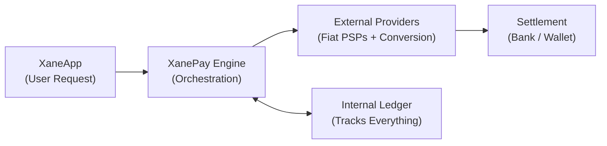
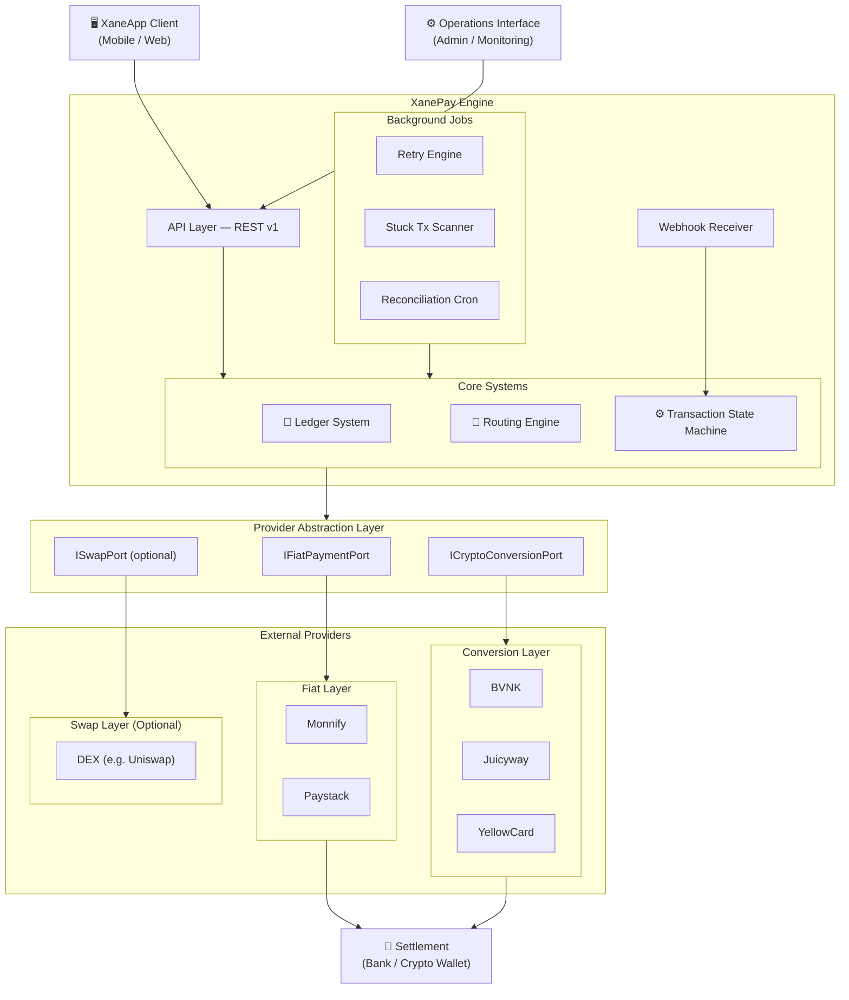
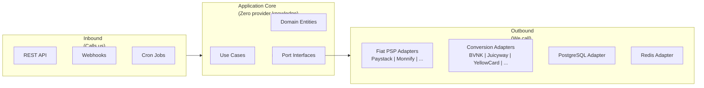
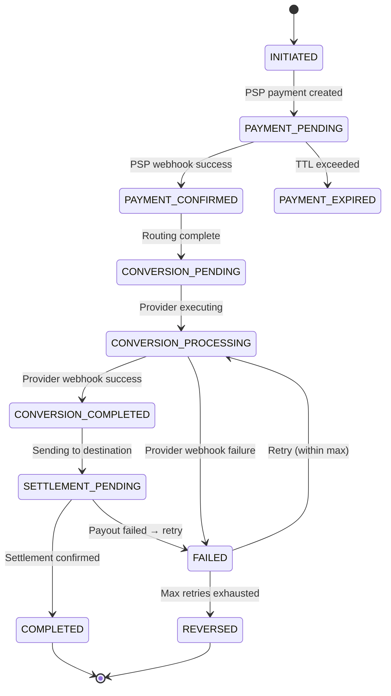
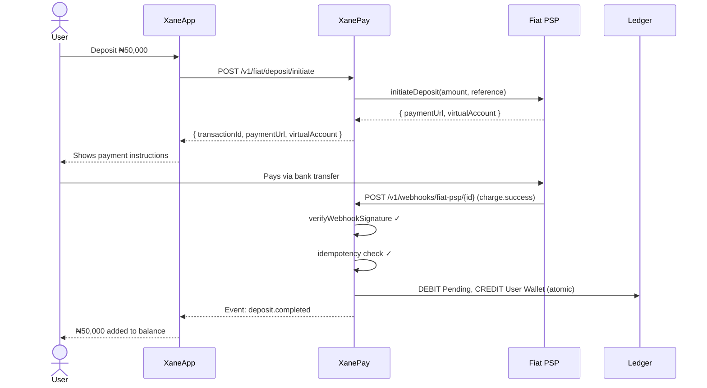
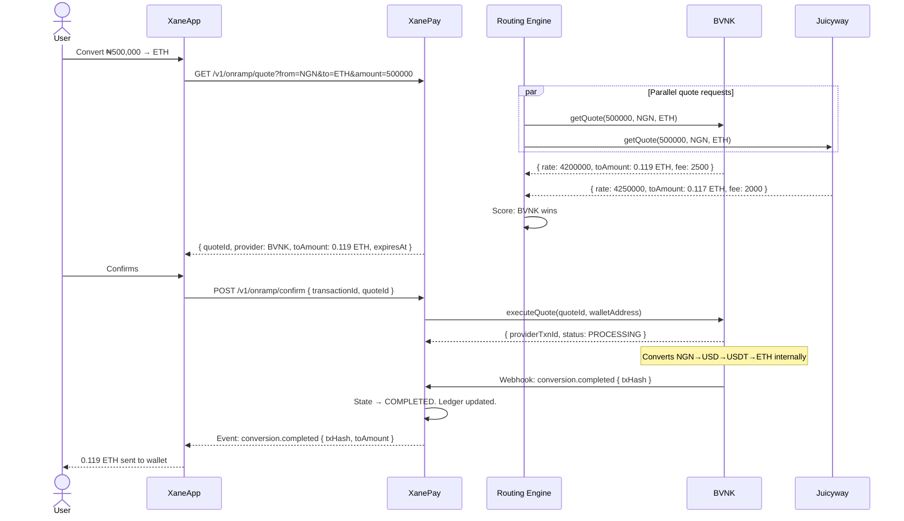

# XanePay – System Architecture Document
## MVP → Scalable
### Version 3.0 — Complete Technical Reference

---

> **How to Read This Document**
>
> Sections 1–12 follow the original XanePay PRD structure, expanded with full
> technical depth for engineering implementation.
>
> **Section 13** covers critical requirements that are NOT in the original PRD
> but without which the system cannot function safely in production.
>
> **Section 14** covers strategic additions that significantly improve the
> system but are not hard blockers for launch.

---

## Table of Contents

**Original PRD Sections (Expanded)**
1. [Overview](#1-overview)
2. [System Responsibilities](#2-system-responsibilities)
3. [High-Level Architecture](#3-high-level-architecture)
4. [Core Components](#4-core-components)
5. [Core Flows](#5-core-flows)
6. [Fee Model](#6-fee-model)
7. [Compliance Layer](#7-compliance-layer)
8. [Risk & Failure Handling](#8-risk--failure-handling)
9. [Optional Advanced Features](#9-optional-advanced-features)
10. [Scalability Strategy](#10-scalability-strategy)
11. [Key Design Principles](#11-key-design-principles)
12. [Final Note](#12-final-note)

**Critical Additions**

13. [Must-Have Requirements (Not in Original PRD)](#13-must-have-requirements-not-in-original-prd)

**Strategic Additions**

14. [Good-to-Have Additions (Recommended)](#14-good-to-have-additions-recommended)

---

## 1. Overview

XanePay is a **fiat and crypto orchestration layer** within XaneApp.
It acts as an **abstraction and routing engine**, enabling seamless:

- Fiat (NGN) deposits and withdrawals
- Fiat ↔ Crypto conversions
- Multi-provider routing and execution

### Core Principle

XanePay primarily **orchestrates external liquidity providers** for fiat and
crypto execution, while maintaining the ability to manage internal treasury
liquidity to optimize speed, cost, and reliability.

#### What This Means in Practice

XanePay does not hold funds, operate as an exchange, or issue accounts.
It is the coordination layer that:

- Receives a request from XaneApp ("convert ₦500,000 to ETH")
- Evaluates which external provider gives the best outcome
- Executes the conversion through that provider
- Tracks every unit of value through the process in an internal ledger
- Settles the result to the user's wallet or bank account



### What XanePay Is — and Is Not

| XanePay IS | XanePay is NOT |
|---|---|
| A financial orchestration engine | A bank or wallet |
| A multi-provider routing layer | An exchange or PSP |
| A double-entry accounting system | A KYC provider |
| A settlement coordinator | A custody solution |
| A compliance enforcement gate | A smart contract platform |

---

## 2. System Responsibilities

### 2.1 Maintain Internal Fiat Ledger (NGN)

XanePay maintains a **double-entry accounting ledger** that records every
movement of value — fiat or crypto — as it passes through the system.

This ledger is the **source of truth** for all balances and transaction history.
It is designed to be:

- **Immutable** — entries are appended, never updated or deleted
- **Auditable** — every entry is linked to a transaction with a full event trail
- **Balanced** — every debit has a corresponding credit of equal value
- **Atomic** — ledger writes and state changes commit together or not at all

### 2.2 Orchestrate Conversion Flows (Fiat ↔ Crypto)

XanePay manages the **complete lifecycle** of every conversion:

```
Fiat Received → Quote Requested → Rate Locked → Conversion Executed → Settled
```

At each step, the state machine advances, the ledger records the movement,
and the event is logged. No step can be skipped.

### 2.3 Route Transactions to Optimal Providers

The Routing Engine evaluates all active, healthy providers in real time
and selects the one that maximises the user's outcome based on a
**configurable scoring model** (rate, speed, reliability, fees).

Provider availability, routing weights, and active status are all
configurable without code changes — through the operations interface.

### 2.4 Handle Retries, Failures, and Reconciliation

XanePay implements structured failure recovery:

- **Automatic retry** with exponential backoff for transient failures
- **Provider failover** — if provider A fails, route to provider B
- **Transaction rollback** with offsetting ledger entries
- **Nightly reconciliation** — system vs. external provider positions compared

### 2.5 Provide APIs for Frontend and Wallet System

All XanePay operations are exposed through a **versioned, secure REST API**.
XaneApp consumes these APIs to initiate transactions, fetch quotes,
confirm executions, receive status updates, and manage operations.

---

## 3. High-Level Architecture



### Architecture: Hexagonal (Ports & Adapters)

XanePay uses **Hexagonal Architecture** to ensure complete provider independence.
The business logic core knows nothing about any specific provider — it only
communicates through **Port interfaces**. Each provider is an **Adapter**
that implements a Port.



**Result:** Adding a new provider = write one Adapter class.
Zero changes to business logic. Zero downtime.

---

## 4. Core Components

### 4.1 Ledger System (CRITICAL)

The ledger implements **double-entry accounting** — the universal standard
used by every regulated financial institution.

#### The Double-Entry Rule

Every financial event creates **two equal and opposite entries**.
The sum of all debits always equals the sum of all credits.
Money cannot appear or disappear — it only moves between accounts.

```
Example: User deposits ₦100,000

  DEBIT  → User Pending Account     ₦100,000
  CREDIT → System Treasury          ₦100,000
                                    ─────────
  Net movement:                     ₦0 (balanced)
```

#### Account Structure

| Account | Type | Purpose |
|---|---|---|
| User NGN Wallet | Per-user | Confirmed available user balance |
| System Treasury | System | Operational funds under system control |
| Pending Settlement | System | Funds received but not yet confirmed settled |
| Fee Revenue | System | XanePay earned margin/spread |
| Provider Escrow | Per-provider | Funds currently with an external provider |

#### Ledger Entry Structure

```
ledger_entries (append-only — never updated, never deleted)
├── id
├── transaction_id    → parent transaction
├── account_id        → which account this entry belongs to
├── entry_type        → DEBIT | CREDIT
├── amount            → always positive
├── currency          → NGN | ETH | USDT | USD
├── description       → human-readable reason
└── created_at        → immutable
```

#### Transaction States

```
INITIATED → PENDING → PROCESSING → COMPLETED
                                 → FAILED
                                 → REVERSED
```

Every state change is recorded in a `transaction_events` log,
including what triggered it and the full raw payload.

### 4.2 Routing Engine

The Routing Engine determines the **best provider** for each transaction
at the exact moment of execution.

#### Inputs

| Input | Source |
|---|---|
| Transaction amount | User request |
| Currency pair (e.g. NGN → ETH) | User request |
| Active providers | Provider Registry (database) |
| Live quotes | Fetched in parallel from all active providers |
| Provider health | Health monitor cache |
| Routing weights | Configurable per provider |

#### Scoring Model

```
score =
  (rate_weight    × best_rate)
+ (speed_weight   × fastest_settlement)
+ (success_weight × historical_reliability)
- (cost_weight    × provider_fees)
```

All weights are **configurable from the operations interface** without code changes.

#### Execution Flow

All active providers are queried **in parallel** to minimise latency
within the 30–60 second rate-lock window. Providers that do not respond
within the configured timeout are excluded from this routing cycle only —
they remain available for subsequent transactions.

#### Output

- Selected provider
- Locked quote (rate, amounts, fees, expiry)
- Execution path (e.g. NGN → USDT → ETH)

### 4.3 Provider Abstraction Layer

Every provider — whether Paystack, BVNK, Juicyway, Monnify, or any future
provider — must implement a **standardised interface**.

The business logic never calls a provider directly.
It calls the interface. The adapter does the translation.

#### IFiatPaymentPort (Fiat PSP Interface)

```
Methods every Fiat PSP must implement:

  initiateDeposit(userId, amount, currency, reference, callbackUrl)
    Returns: paymentUrl | virtualAccountNumber, expiresAt

  verifyWebhookSignature(rawPayload, signatureHeader)
    Returns: boolean — reject all requests where this returns false

  parseWebhookEvent(rawPayload)
    Returns: NormalizedPaymentEvent { status, reference, amount, timestamp }

  getTransactionStatus(providerReference)
    Returns: NormalizedPaymentStatus { status, amount, settledAt? }
    (Used when webhook never arrives — polling fallback)
```

#### ICryptoConversionPort (Conversion Provider Interface)

```
Methods every Conversion Provider must implement:

  getQuote(fromCurrency, toCurrency, fromAmount?, toAmount?)
    Returns: { quoteId, fromAmount, toAmount, rate, fee, expiresAt }

  executeQuote(quoteId, destinationAddress?, destinationBank?, reference)
    Returns: { providerTransactionId, status: PENDING | PROCESSING }

  getTransactionStatus(providerTransactionId)
    Returns: { status, completedAt?, txHash?, failureReason? }

  verifyWebhookSignature(rawPayload, signatureHeader)
    Returns: boolean

  parseWebhookEvent(rawPayload)
    Returns: NormalizedConversionEvent { status, providerTxnId, txHash? }
```

Each provider adapter encapsulates its own:
- Authentication and credential handling
- Request/response format translation
- Error normalisation and classification
- Webhook signature algorithm (each provider uses a different one)

### 4.4 Transaction State Machine

Every transaction follows a **strictly enforced lifecycle**.
Invalid transitions are rejected at the application layer.



The state machine handles:
- **Async operations** — transitions are driven by webhooks, not blocking calls
- **Webhooks** — each provider event is validated, parsed, and mapped to a state transition
- **Failures** — every failure state has a defined recovery or terminal path

---

## 5. Core Flows

### 5.1 Add Money — NGN Deposit (Onramp)

```
Flow:
  1. User initiates deposit in XaneApp
  2. XanePay calls active Fiat PSP (Monnify or Paystack)
  3. PSP returns payment link or virtual account number
  4. User completes payment via their bank
  5. PSP sends webhook to XanePay
  6. XanePay verifies webhook signature
  7. XanePay updates state machine and records to ledger

API: POST /v1/fiat/deposit/initiate
```



### 5.2 Convert — NGN to Crypto (Onramp)

```
Flow:
  1. User inputs amount in XaneApp
  2. XanePay requests quotes from all active conversion providers (parallel)
  3. Routing Engine selects best provider (scored)
  4. Rate is locked for 30–60 seconds
  5. User confirms
  6. Execution begins with selected provider
  7. Provider handles internal conversion path:
       NGN → USD (provider internal)
       USD → USDT (provider internal)
       USDT → ETH (provider or DEX)
  8. Crypto delivered to user wallet
```



### 5.3 Convert — Crypto to NGN (Offramp)

```
Flow:
  1. User selects asset (e.g. ETH) in XaneApp
  2. XanePay requests quote from active conversion providers
  3. Routing Engine selects best provider
  4. User confirms — provides destination (bank or XanePay balance)
  5. XanePay provides deposit address for user's crypto
  6. User sends crypto to deposit address
  7. On-chain receipt confirmed (webhook or polling)
  8. Provider swaps ETH → USDT → NGN
  9. NGN sent to:
       - User's linked bank account, OR
       - User's XanePay NGN balance
```

### 5.4 Cashout — Critical Flow

```
Flow:
  Crypto → Stablecoin (internal to conversion provider)
  → Provider conversion (stablecoin → NGN)
  → Fiat payout (via active PSP)
  → User bank account

Failure Handling:
  If payout fails:
    Retry up to configured max (default: 3 attempts)
    Backoff: 1 min → 5 min → 15 min

  If max retries exhausted:
    Credit NGN to user's XanePay balance (funds are safe)
    Log full failure context
    Alert operations team
    Transaction moves to CREDITED_TO_BALANCE (resolvable from admin)
```

---

## 6. Fee Model

### Fee Components

| Component | Range | Who Controls It |
|---|---|---|
| FX Spread (Xane margin) | 0.5% – 1.5% | XanePay (configurable per currency pair) |
| Provider Fees | Variable (~0.5%) | External provider (passed through) |
| Network / Gas Fee | Variable | Passed through at cost or capped |

### How Fees Are Applied

```
Provider rate:    1 ETH = ₦4,200,000
Xane spread:      1.0% = ₦42,000
Provider fee:     0.5% = ₦21,000
─────────────────────────────────
User pays:        1 ETH = ₦4,263,000
XanePay earns:    ₦42,000 (spread only — provider fee goes to provider)
```

### Fee Configuration

All margins and spreads are **configurable per currency pair** without code changes.
Administrators can update fee percentages through the operations interface,
and changes take effect on the next transaction.

---

## 7. Compliance Layer

### KYC Requirements

| Action | KYC Required | Reason |
|---|---|---|
| Wallet usage only | No | No regulated fiat movement |
| Fiat deposit (NGN) | Yes | Regulated entry point |
| Fiat → Crypto conversion | Yes | Exchanging regulated instrument |
| Crypto → Fiat conversion | Yes | Regulated exit point |
| Withdrawal to bank | Yes | AML/CFT obligation |

### Tiered KYC System (Recommended)

| Tier | Verification | Limits |
|---|---|---|
| Tier 0 | None | View quotes only. No transactions. |
| Tier 1 | Phone + BVN | Max ₦50,000/day, ₦200,000/month |
| Tier 2 | Government ID + Selfie | Max ₦500,000/day, ₦2M/month |
| Tier 3 | Full KYC + Proof of Address | Custom limits |

### KYC Architecture

The XanePay engine enforces KYC as a **pre-execution gate**.
Before any conversion or withdrawal executes, the engine queries
the KYC service (XaneApp's responsibility to provide).

KYC is integrated through a dedicated `IKYCPort` interface,
making the KYC provider independently replaceable without
impacting conversion logic.

### Transaction Limits for Non-KYC Users

Users below Tier 1 can use the XaneApp wallet for internal transfers
but are blocked from initiating any conversion or bank transaction
until KYC is completed.

---

## 8. Risk & Failure Handling

### Failure Categories

| Failure | Example | Handling |
|---|---|---|
| PSP Webhook Failure | Webhook delayed, duplicate, or malformed | Signature verification → idempotency check → polling fallback |
| Provider Downtime | BVNK API unreachable | Health monitor marks DEGRADED → routing skips automatically |
| Price Slippage | Market moved before quote executed | Quote expiry strictly enforced. Expired quotes rejected — new quote required. |
| Partial Execution | Conversion succeeded but payout failed | Ledger tracks each step independently. Payout retried independently. |
| Network Timeout | HTTP timeout calling provider | Retry with exponential backoff. Status polled separately via `getTransactionStatus()`. |

### Mechanisms

#### Retry Engine
- Max attempts configurable per provider and per failure type
- Exponential backoff: 1 min → 5 min → 15 min
- Error classification: retryable (network, timeout) vs. terminal (invalid account, KYC fail)
- On exhaustion: DLQ + operations alert + user notification

#### Transaction Rollback
- When a conversion fails terminally, offsetting ledger entries are created
- Net effect: user's balance is restored to pre-transaction state
- All reversal entries are logged with `entry_type = REVERSAL` for audit clarity

#### Ledger Reconciliation
- Nightly background job compares internal ledger against provider-reported positions
- Discrepancies above configured threshold are flagged for manual review
- Full report generated and accessible through the operations interface

#### Provider Failover
- Health monitor continuously tracks provider success rates
- When a provider's success rate drops below threshold, it is marked DEGRADED
- Routing Engine automatically skips DEGRADED providers
- Operations can manually disable a provider instantly without code changes

---

## 9. Optional Advanced Features

These features are designed for and can be activated without architectural changes.

| Feature | Description | What It Requires |
|---|---|---|
| **Rate Locking (30–60s)** | Lock a quote while user confirms | Redis TTL on quote object — already in architecture |
| **Multi-Provider Fallback** | Auto-retry on next provider if first fails mid-execution | Already supported by retry + routing engine |
| **Auto-Routing Optimisation** | Weight routing decisions using live, ML-scored success data | Replace scoring model in Routing Engine |
| **Real-Time Pricing Engine** | Stream live rates via WebSocket for instant quote display | New pricing adapter + WebSocket gateway |

> [!IMPORTANT]
> **Treasury & Liquidity** is NO LONGER an optional feature.
> XanePay controls its own ledger and its own treasury.
> The Treasury Control Layer — including the internal fiat and crypto treasury,
> the `ITreasuryPort` interface, and the Replenishment Engine — is a **core
> architectural component**, not an enhancement.
>
> Full specification: [`docs/TREASURY_AND_CUSTODY_MODEL.md`](./TREASURY_AND_CUSTODY_MODEL.md)

---

## 10. Scalability Strategy

### MVP Phase

| Component | Configuration |
|---|---|
| Fiat PSPs | 1 active (Paystack or Monnify) |
| Conversion Providers | 1–2 active (Juicyway, BVNK) |
| Routing | Best-rate selection from active providers |
| Database | Single PostgreSQL instance |
| Queues | Single BullMQ instance |
| Deployment | Single containerised service |

> **Key point:** Even with 1 provider at MVP, the system is built so that
> a second or third provider can be added from the operations interface
> with **zero code changes**. This is a core architectural commitment, not a future plan.

### Growth Phase

| Component | Configuration |
|---|---|
| Fiat PSPs | 2+ with automatic failover |
| Conversion Providers | 3–5 for treasury replenishment (not primary settlement) |
| Routing | Treasury Path (primary) + Provider Path (fallback) |
| Database | Read replicas for reporting queries |
| Queues | Redis Cluster for distributed jobs |
| Deployment | Horizontally scaled containers behind load balancer |
| Fiat Treasury | XanePay-controlled NGN settlement account — sweeps from PSPs |
| Crypto Treasury | XanePay-controlled hot wallet — ETH/USDT inventory |
| Replenishment Engine | Auto-buys from providers when treasury drops below threshold |

> See [`docs/TREASURY_AND_CUSTODY_MODEL.md`](./TREASURY_AND_CUSTODY_MODEL.md) for full treasury architecture.

### Adding a Provider at Any Scale

```
Step 1: Write a new Adapter class implementing the relevant Port interface
Step 2: Deploy updated code (one file added, nothing else changed)
Step 3: In the Operations Interface:
         → Provider Management → Add Provider
         → Fill in name, type, credentials (saved to secrets manager)
         → Set routing weights and transaction limits
         → Toggle Active
         → Done

No business logic touched. No server restart required for configuration.
New provider is live and included in routing immediately.
```

---

## 11. Key Design Principles

| Principle | Implementation |
|---|---|
| **Provider-agnostic architecture** | All provider interaction through Port interfaces. No provider name in business logic. |
| **Separation of concerns** | PSP (receive fiat) ≠ Conversion Provider (exchange value) ≠ Settlement (deliver). Each independently replaceable. |
| **Fail-safe transactions** | Every flow has a defined failure path. Money always ends up somewhere accountable — never silently lost. |
| **Asynchronous processing** | All provider interactions are async. Webhooks are primary. Polling is fallback. State machine advances only from confirmed events. |
| **User experience first** | Users see a simple "quote → confirm → done" flow. All complexity is hidden in the engine. |

---

## 12. Final Note

XanePay is not a wallet, exchange, or PSP.

It is a **financial orchestration engine** that routes value across fiat and crypto systems.

This architecture ensures:
- **Flexibility** — swap or add any provider without touching business logic
- **Scalability** — horizontal scaling at the application layer, read replicas at the data layer
- **Provider independence** — no single provider can hold the system hostage
- **Long-term defensibility** — the orchestration layer is the moat, not the providers themselves

---

---

## 13. Must-Have Requirements (Not in Original PRD)

> These are not enhancements. They are **prerequisites** for the system to
> function safely with real money in production. The original PRD does not
> mention them, but any financial system built without them will inevitably
> lose money, double-credit users, or have unresolvable failures.

---

### 13.1 Idempotency System

**What it is:** A mechanism that guarantees any operation — whether an API call
or a webhook — can be received multiple times without executing more than once.

**Why it is critical:** Networks are unreliable. PSPs fire webhooks twice.
Clients retry API calls on timeout. Without idempotency, a user can be
credited ₦500,000 twice for one payment, or a conversion can execute twice.

**How it works:**

```
Every transaction creation endpoint requires an Idempotency-Key header.
The key is stored with a UNIQUE database constraint.

First call:  Process request. Store key + result.
Second call: Find existing key. Return stored result. Do nothing.

Every webhook payload is hashed (SHA-256).
Before processing: check if hash exists in processed-webhooks store.
If exists: acknowledge (HTTP 200) and discard. No processing.
```

**Impact if missing:** Double-credits are virtually guaranteed in production.
One duplicate webhook = one user receiving crypto they didn't pay for.

---

### 13.2 Webhook Security Pipeline

**What it is:** A multi-layer validation chain that runs before any webhook
payload is trusted or processed.

**Why it is critical:** Webhooks are unauthenticated HTTP requests. Without
validation, anyone can send a fake "payment confirmed" webhook to your system
and receive crypto without paying.

**The Pipeline (must execute in this order):**

```
1. IP Allowlist Check
   Only accept requests from provider-declared IP ranges.
   Reject all others before any parsing.

2. HMAC Signature Verification
   Every provider signs payloads with a shared secret using HMAC-SHA512 (or SHA-256).
   The system re-computes the expected signature and compares.
   Reject immediately if they don't match — no further processing.

3. Timestamp Validation
   Reject payloads with a timestamp older than 5 minutes.
   Prevents replay attacks (attacker captures a real webhook and replays it later).

4. Idempotency Check
   Hash the payload. Check against processed-webhooks store.
   If already processed: return HTTP 200 and stop.

5. Schema Validation
   Validate the payload structure against the expected schema.
   Reject malformed payloads with HTTP 400.

6. Route to State Machine
   Only now is the payload passed to business logic.
```

**Impact if missing:** A malicious actor can fake a payment confirmation
and receive crypto without paying. This is a direct financial loss.

---

### 13.3 Dynamic Provider Registry

**What it is:** A database-driven provider configuration system that allows
the operations team to add, configure, enable, disable, and tune providers
entirely from the frontend — with no code changes required.

**Why it is critical:** The original PRD mentions "add more providers" in
the growth phase but does not explain how. Without this, every provider
change requires a developer, a code deployment, and downtime — which is
operationally unacceptable for a live financial system.

**What the Provider Registry enables:**

| Action | Result |
|---|---|
| Add a new provider | Fill form in operations panel → provider is live |
| Disable a provider | Toggle → immediately excluded from routing |
| Adjust routing weights | Update weights → applied on next transaction |
| Set per-provider limits | Update min/max amounts → enforced immediately |
| View provider health | Dashboard reads live metrics |
| Force failover | Disable provider → system routes to next available |

**Provider Registry Schema (key fields):**

```
providers table
├── name                  "Paystack", "BVNK", etc.
├── type                  FIAT_PSP | CRYPTO_CONVERSION | SWAP
├── adapter_class         Maps to code class: "PaystackAdapter"
├── is_active             Toggle from frontend
├── supported_pairs       ["NGN→ETH", "NGN→USDT"]
├── routing_weights       { rate: 0.4, speed: 0.2, success: 0.3, cost: 0.1 }
├── rate_limit_per_min    Max requests per minute
├── timeout_ms            Request timeout for this provider
├── credentials_ref       Reference to secrets manager key (NOT the secret)
├── webhook_secret_ref    Reference to webhook HMAC secret
├── health_status         HEALTHY | DEGRADED | DOWN
├── success_rate_7d       Auto-calculated from transactions
└── avg_settlement_ms     Auto-calculated from completed transactions
```

**Credential security:** API keys and webhook secrets are **never stored
in the database**. Only a reference key is stored (e.g. `vault://providers/paystack/api-key`).
The actual secret is resolved from a secrets manager at runtime.

---

### 13.4 Atomic Ledger Writes (ACID Enforcement)

**What it is:** Every money movement in the system — ledger entries,
state changes, event logs — is committed in a **single database transaction**.
If any part fails, all parts roll back together.

**Why it is critical:** Without atomicity, a partial failure can produce
a state where money is debited from a user's account but the state machine
shows the transaction as pending — the user lost money with no record of where it went.

**The pattern:**

```
BEGIN TRANSACTION
  1. Lock account row (SELECT FOR UPDATE — prevents concurrent modification)
  2. Validate balance is sufficient
  3. Write DEBIT ledger entry
  4. Write CREDIT ledger entry
  5. Update transaction status
  6. Append transaction_event record
COMMIT TRANSACTION
  → All succeed, or all roll back. No partial states.
```

---

### 13.5 Append-Only Ledger with Computed Balances

**What it is:** The ledger never stores a `balance` column.
Balance is always calculated as `SUM(credits) - SUM(debits)` across all entries
for an account. Ledger rows are never updated or deleted — only new rows are added.

**Why it is critical:** If a stored balance field can be updated,
a bug (or a malicious actor) can change a user's balance without creating
any corresponding transaction history. The history IS the source of truth.

**The anti-pattern to avoid:**

```sql
-- ❌ WRONG — balance can drift from history, can be manipulated
UPDATE accounts SET balance = balance - 500000 WHERE id = :userId

-- ✅ CORRECT — balance is always provable from the ledger
SELECT
  SUM(CASE WHEN entry_type = 'CREDIT' THEN amount ELSE 0 END) -
  SUM(CASE WHEN entry_type = 'DEBIT'  THEN amount ELSE 0 END)
FROM ledger_entries
WHERE account_id = :accountId
```

---

### 13.6 Row-Level Locking (Concurrency Protection)

**What it is:** When reading an account balance before debiting it,
the row is locked (`SELECT ... FOR UPDATE`) so no other transaction
can read or modify it until the current transaction commits.

**Why it is critical:** Without locking, two simultaneous withdrawal
requests can both read the same balance, both see sufficient funds,
and both execute — leaving the account overdrawn.

```
Without locking:
  Request A reads balance = ₦100,000 ✓
  Request B reads balance = ₦100,000 ✓  (same time)
  Request A debits ₦80,000 → balance = ₦20,000
  Request B debits ₦80,000 → balance = -₦60,000  💥

With locking:
  Request A: SELECT FOR UPDATE → acquires lock
  Request B: SELECT FOR UPDATE → waits
  Request A: Debit ₦80,000 → COMMIT → releases lock
  Request B: Acquires lock → balance = ₦20,000 < ₦80,000 → REJECT ✓
```

---

### 13.7 Transaction Observability & Admin Resolution Console

**What it is:** A complete read + action interface exposed through the
operations API that allows the operations team to see, diagnose, and
resolve any transaction entirely from the frontend — without server access.

**Why it is critical:** In production, transactions will get stuck.
PSPs will fire webhooks late. Providers will time out. Without observability,
the only way to investigate is to SSH into a server and query the database
manually — which is slow, dangerous, and unscalable.

**What must be visible per transaction:**

```
Transaction Detail View
├── Overview
│   ├── Transaction ID, User ID, Type, Current Status
│   ├── Amounts (from / to / fee), Provider assigned
│   └── All timestamps (created, each state change)
│
├── State Timeline
│   ├── Every status transition with timestamp
│   ├── What triggered each transition (webhook / user / system / admin)
│   └── Full raw payload for each event (expandable JSON)
│
├── Ledger Entries
│   ├── All debit/credit entries linked to this transaction
│   └── Net balance effect per account
│
└── Resolution Actions
    ├── Retry failed step (re-queue for one more attempt)
    ├── Re-route to a different provider
    ├── Force reversal (offsetting ledger entries + user notification)
    ├── Mark as manually resolved (with required audit note + admin ID)
    └── Change max retry count for this transaction
```

Every admin action is logged to `transaction_events` with
`triggered_by = "admin:{adminUserId}"` for full accountability.

---

### 13.8 Stuck Transaction Recovery (Background Jobs)

**What it is:** Scheduled background jobs that scan for transactions
that have been in a non-terminal state longer than a configured threshold
and take corrective action.

**Why it is critical:** The original PRD mentions webhooks as the primary
event mechanism — but webhooks can fail to arrive. A transaction can be
stuck in `PAYMENT_PENDING` forever if the PSP's webhook was lost.
Without recovery jobs, those transactions stay stuck permanently.

**Jobs Required:**

| Job | Trigger | Action |
|---|---|---|
| `StuckPaymentJob` | Every 5 minutes | Scans `PAYMENT_PENDING` > TTL → polls PSP → advances or expires state |
| `StuckConversionJob` | Every 5 minutes | Scans `CONVERSION_PROCESSING` > threshold → polls provider → advances or fails |
| `StuckSettlementJob` | Every 5 minutes | Scans `SETTLEMENT_PENDING` > threshold → polls PSP → advances or retries |
| `ReconciliationJob` | Nightly | Compares internal ledger with provider reports → flags discrepancies |

---

### 13.9 Secrets Management

**What it is:** A system for securely storing and accessing provider
API keys and webhook secrets — outside of the application code,
configuration files, and database.

**Why it is critical:** Provider API keys grant full access to financial
operations. If they are stored in code, a git repository leak exposes them.
If stored in the database, a SQL injection exposes them. Either way,
an attacker can move money through your providers.

**The pattern:**

```
Operations team registers a provider through the admin UI.
Credentials (API key, webhook secret) are:
  → Sent to the API
  → Immediately written to a Secrets Manager (e.g. AWS Secrets Manager)
  → A reference key is stored in the providers table (e.g. "vault://paystack/api-key")
  → The actual credential is NEVER stored in the database

At runtime, when the adapter needs the credential:
  → Resolves the reference key via Secrets Manager SDK
  → Uses the value in memory for the request
  → Value is never logged, never returned in API responses
```

---

## 14. Good-to-Have Additions (Recommended)

> These features are not required for a safe, functional MVP.
> However, they significantly improve operational efficiency,
> business intelligence, and user experience. They should be
> planned for and the architecture should not prevent them.

---

### 14.1 Operations Dashboard (Metrics & Monitoring)

A visual dashboard surfacing:

| Metric | Value |
|---|---|
| Total volume (24h / 7d / 30d) | In NGN and crypto |
| Transaction count by type | Onramp vs Offramp |
| Success rate per provider | % completed vs failed |
| Average settlement time | Per provider, per type |
| XanePay fee revenue | By period and currency pair |
| Stuck / DLQ transactions | Count + quick-access list |
| Provider health grid | Real-time status of all active providers |

**Why recommended:** Without this, the operations team is flying blind.
They cannot quickly identify if a provider is degraded or if revenue
dropped because of a routing issue.

---

### 14.2 Provider Health Monitoring with Auto-Degradation

A background monitor that:
- Pings each active provider on a configurable interval
- Tracks success rate over a rolling window (last 10 / 50 / 100 calls)
- Automatically marks a provider as `DEGRADED` if success rate drops below threshold
- Alerts the operations team via configured notification channel
- Automatically restores to `HEALTHY` when performance recovers

**Why recommended:** Without this, a failing provider remains in the routing
pool and continues to receive traffic — causing user-facing failures until
an operator manually intervenes.

---

### 14.3 Webhook Event Replay

The ability for an administrator to select any past webhook event
from the `transaction_events` log and replay it through the state machine.

**Use case:** A webhook arrived but the system was briefly down.
The transaction is stuck. Rather than manually resolving it, the admin
can replay the webhook and let the system process it normally.

---

### 14.4 Audit Log Export

The ability to export full transaction logs and ledger entries
as structured data (CSV or JSON) filtered by date range, user,
provider, or transaction type.

**Why recommended:** Required for regulatory audits, for accounting
reconciliation, and for finance teams to verify revenue figures.

---

### 14.5 Fee Calculator Preview

An API endpoint (and corresponding UI) that shows users the
exact breakdown of a conversion before they confirm:

```
You send:         ₦500,000
Provider rate:    1 ETH = ₦4,200,000
XanePay spread:   1.0% = ₦4,200
Provider fee:     0.5% = ₦2,100
─────────────────────────────────
You receive:      0.1181 ETH
Total cost:       ₦506,300
```

**Why recommended:** Transparency reduces support queries and increases
user trust and conversion rates.

---

### 14.6 Provider Performance Analytics Over Time

Historical charts showing per-provider:
- Success rate trend (30-day)
- Average settlement speed trend
- Fee history (if provider rates change)
- Volume routed

**Why recommended:** Allows the operations team to make data-driven
decisions about routing weights, provider priorities, and when to
negotiate better rates with a provider.

---

### 14.7 A/B Routing (Traffic Splitting)

The ability to route a configurable percentage of transactions
to two different providers simultaneously — for testing a new
provider's real-world performance before fully switching to it.

**Configuration example:**
```
NGN → ETH transactions:
  60% → Provider A (primary)
  40% → Provider B (testing)
```

**Why recommended:** Allows safe introduction of new providers without
committing 100% of traffic before confidence is established.

---

### 14.8 In-App Alerts for Operational Events

Push or email notifications to the operations team for:

| Event | Priority |
|---|---|
| No successful transactions in 15 minutes | 🔴 Critical |
| Provider X has had 5 consecutive failures | 🔴 Critical |
| DLQ has > N items requiring review | 🟠 High |
| Reconciliation found a discrepancy | 🟠 High |
| Provider marked DEGRADED automatically | 🟡 Medium |
| Daily revenue summary | 🟢 Info |

---

### 14.9 Multi-Currency Support (Beyond NGN/ETH)

The routing engine and ledger are already designed currency-agnostically.
Extending to new pairs (e.g. NGN → USDT, NGN → BTC, GHS → ETH) requires:
- Adding the new pair to supported provider configs (admin panel)
- No core code changes

**Why recommended:** Future-proofs the system and significantly expands the addressable market.

---

*Document version: 3.0 | XanePay Complete Architecture Reference*
*Sections 1–12: Based on original XanePay PRD, technically expanded.*
*Section 13: Critical requirements not in original PRD — must be built.*
*Section 14: Strategic additions — recommended for production quality.*
