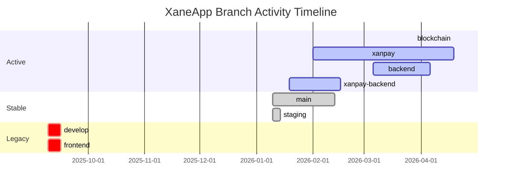
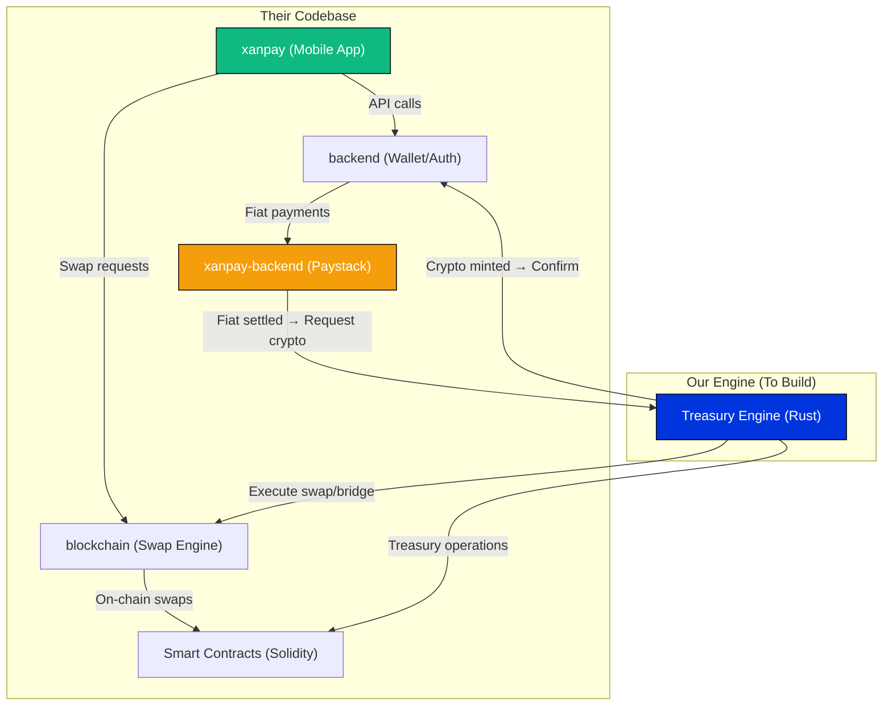

# XaneApp Repository — Full Branch-by-Branch Analysis

> [!NOTE]
> This document is the result of scanning every branch on `https://github.com/xaneApp/XaneApp.git`. Each branch is analyzed for: purpose, tech stack, key files, activity level, and relevance to our Treasury Engine integration.

---

## Repository Overview

| Property | Value |
|---|---|
| **Repo** | `xaneApp/XaneApp` |
| **Total Branches** | 7 (excluding HEAD) |
| **Primary Language** | TypeScript (blockchain/main), JavaScript (backend/xanpay-backend) |
| **Database** | Firebase Firestore (primary), PostgreSQL (being added on `blockchain`) |
| **Auth** | Firebase Admin + Phone OTP + WebAuthn/Passkeys |
| **Wallet System** | Web3Auth MPC Core Kit + Ethers.js |
| **Fiat Gateway** | Paystack (Nigerian market — card, USSD, bank transfer, virtual accounts) |
| **Mobile App** | React Native (Expo) — exists on `xanpay` branch |
| **Smart Contracts** | Foundry/Solidity — `XaneGaslessSwaps.sol` |

---

## Branch Timeline (Most Recent → Oldest)



---

## 1. `main` Branch — Production Baseline

| Property | Detail |
|---|---|
| **Last Updated** | 2026-02-13 (Merge PR #7 from staging) |
| **Language** | TypeScript |
| **Entry Point** | `src/index.ts` — Express.js server |
| **Status** | ⚠️ STALE — Not the active development branch |

### What It Contains
This is the original **blockchain-focused backend** written in TypeScript. It is a feature-rich swap/bridge engine:

**Routes:** `/user`, `/passkey`, `/wallet`, `/otp`, `/swap`, `/contract`, `/monitoring`

**Key Services:**
- `dynamicFeeCalculator.ts` — 773 lines of fee logic (gas estimation, bridge fees, slippage)
- `relayerService.ts` — 816 lines for gasless transaction relaying (meta-transactions)
- `transactionService.ts` — 640 lines for on-chain tx building/submission
- `bridgeAdapterFactory.ts` — Multi-bridge routing (Wormhole, Hashport, Stargate)
- `contractInteractionService.ts` — Direct smart contract calls via ethers.js
- `swapOracle.ts` — Price oracle aggregation
- `liquidityTracker.ts` — Pool liquidity monitoring
- `rebalancingMonitor.ts` — Automated pool rebalancing
- `chainlinkGasOracle.ts` — Gas price feeds from Chainlink
- `monitoringService.ts` — System health metrics

**Infrastructure:**
- Firebase Admin (Firestore + Auth)
- Redis caching (`ioredis`)
- Swagger API docs
- Pino structured logging

**Smart Contracts (Foundry):**
- `XaneGaslessSwaps.sol` — Main swap contract with gasless execution
- `HashportBridgeAdapter.sol` — Hedera bridge adapter
- `HederaDEXAdapter.sol` — Hedera DEX integration
- Bridge & DEX adapter interfaces (`IBridgeAdapter`, `IDEXAdapter`)

> [!IMPORTANT]
> This branch represents the **theoretical swap engine** they built first. It has comprehensive test suites (80%+ coverage thresholds) but appears to have been superseded by the `backend` and `xanpay-backend` branches which pivoted to a simpler JavaScript architecture focused on **fiat wallet operations** first.

---

## 2. `blockchain` Branch — Most Advanced (Swap Infrastructure)

| Property | Detail |
|---|---|
| **Last Updated** | 2026-04-19 ⭐ (MOST RECENT) |
| **Language** | TypeScript |
| **Diverges from main** | +4,188 lines / -325 lines |
| **Status** | 🟢 ACTIVELY DEVELOPED |

### What's New vs Main
This is `main` + significant blockchain infrastructure additions:

**New Files:**
- `src/adapters/stargateAdapter.ts` — Stargate (LayerZero) cross-chain bridge
- `src/services/swapBuilder.ts` — Transaction builder for Uniswap V3 swaps
- `src/services/routeGenerator.ts` — Multi-hop route generation
- `src/services/phase1Initializer.ts` — Phase 1 bootstrap service
- `src/controllers/swapController.phase1.ts` — Phase 1 swap controller
- `src/config/chains.config.ts` — **465 lines** — Full multi-chain registry (15+ chains)
- `src/config/routerAddresses.ts` — DEX router addresses per chain
- `src/config/database.ts` — PostgreSQL connection module
- `db/migrations/001_create_initial_schema.sql` — PostgreSQL schema for swap tracking
- `docker-compose.yml` — Docker setup for PostgreSQL + pgAdmin
- `contracts/docs/MULTICHAIN_EXPANSION_PLAN.md` — 1,041-line expansion roadmap

**Supported Chains (from `chains.config.ts`):**

| Network | Chains |
|---|---|
| **EVM Testnets** | Sepolia, Polygon Amoy, Arbitrum Sepolia, Base Sepolia, Optimism Sepolia, Avalanche Fuji, Linea Testnet, Scroll Sepolia |
| **EVM Mainnets** | Ethereum, Arbitrum, Optimism, Base, Polygon, Avalanche, Linea, Scroll |
| **Non-EVM** | Hedera Testnet (partial) |

**Supported Bridges:** Wormhole, Stargate, LayerZero, Across, Hashport

> [!IMPORTANT]
> This is where the **swap/bridge infrastructure** lives. It is the most technically advanced branch in the repo. Our Engine will need to integrate with or replace parts of this infrastructure for the fiat-to-crypto conversion flow.

---

## 3. `backend` Branch — Fiat Wallet Backend (JavaScript Rewrite)

| Property | Detail |
|---|---|
| **Last Updated** | 2026-04-06 |
| **Language** | JavaScript (NOT TypeScript) |
| **Entry Point** | `src/server.js` — Express.js server |
| **Diverges from main** | Complete rewrite — removes ALL TypeScript swap services |
| **Status** | 🟢 ACTIVE — Core wallet/auth backend |

### What Changed
This branch **completely replaced** the TypeScript blockchain services with a simpler JavaScript backend focused on **user wallet management and fiat operations**:

**New Routes (JavaScript):**
- `src/routes/phoneAuth.js` — Phone number OTP authentication
- `src/routes/wallet.js` — Multi-account wallet CRUD
- `src/routes/user.js` — User profile, saved addresses, tag management
- `src/routes/passkey.js` — WebAuthn/Passkey registration & verification
- `src/routes/guardian.js` — M-of-N social recovery guardian system
- `src/routes/recovery.js` — Account recovery with guardian approval + timelock
- `src/routes/relayer.js` — Transaction relaying
- `src/routes/alias.js` — Username/tag binding
- `src/routes/webhook.js` — External event webhooks
- `src/routes/adminAuth.js` — Admin role authentication
- `src/routes/notificationRoutes.js` — Push notifications

**New Services:**
- `src/services/walletAccount.js` — Wallet CRUD (create, credit, debit, transfer)
- `src/services/auditLog.js` — Transaction audit trail
- `src/services/notification.js` — Notification dispatching
- `src/services/kycService.js` — KYC verification service

**New Models:**
- `src/models/PhoneAccount.js` — Phone-based identity (hash-indexed, salted)
- `src/models/KYC.js` — KYC data model

**Key Architecture Decisions:**
- Firebase Firestore as sole database (no PostgreSQL)
- Phone number is the primary identity (hashed with salt)
- Wallet balance is a simple numeric field in Firestore
- Transactions recorded in a `transactions` Firestore collection
- Audit log for every wallet operation

> [!WARNING]
> This branch has **zero blockchain/swap logic**. All the TypeScript services from `main` (`dynamicFeeCalculator`, `swapOracle`, `relayerService`, etc.) are **deleted**. This is purely a fiat wallet backend.

---

## 4. `xanpay-backend` Branch — Fiat + Paystack Integration

| Property | Detail |
|---|---|
| **Last Updated** | 2026-02-16 |
| **Language** | JavaScript |
| **Diverges from main** | Same as `backend` + Paystack payment gateway |
| **Status** | 🟡 SEMI-ACTIVE — Last Paystack-specific work |

### What's New vs `backend`
This extends the `backend` branch with full **Paystack integration** for Nigerian fiat operations:

**New Files:**
- `src/routes/paystackwallet.js` — **274 lines** — Complete fiat wallet flow:
  - `POST /fund/initialize` — Start Paystack card/USSD/transfer payment
  - `POST /fund/verify` — Verify payment & credit wallet (idempotent)
  - `POST /virtual-account` — Create dedicated Paystack virtual bank account
  - `POST /withdraw` — Transfer API withdrawal to Nigerian bank account
  - `GET /:accountId/transactions` — Transaction history
  - `GET /:accountId/receipt/:transactionId` — Transaction receipt
- `src/routes/paystackwebhook.js` — Paystack webhook handler
- `src/services/paystack.service.js` — Paystack API wrapper
- `src/models/PaystackTransaction.js` — Payment record model
- `src/models/User.js` — Extended user model with Paystack customer ID
- `src/models/Withdrawal.js` — Withdrawal tracking model
- `src/config/paystack.js` — Paystack API key configuration
- `src/utils/verifywebhook.js` — Webhook signature verification

> [!IMPORTANT]
> **THIS IS THE CRITICAL BRANCH FOR OUR ENGINE INTEGRATION.** The Paystack wallet routes define the exact fiat on-ramp/off-ramp flow. When a user funds their wallet via Paystack, the money enters the system as a **fiat balance** in Firestore. Our Treasury Engine's job is to take that fiat position and convert it into crypto — which is the gap between this branch and the `blockchain` branch.

---

## 5. `xanpay` Branch — Full Monorepo (Mobile App + Backend + Contracts)

| Property | Detail |
|---|---|
| **Last Updated** | 2026-04-19 ⭐ |
| **Language** | TypeScript/JavaScript (mixed) |
| **Structure** | Monorepo: `XaneApp/Xane_UX/` (mobile) + `contracts/` |
| **Status** | 🟢 ACTIVELY DEVELOPED — Most complete branch |

### Structure
```
xanpay/
├── XaneApp/
│   └── Xane_UX/                    # React Native (Expo) Mobile App
│       ├── app/
│       │   ├── auth/               # Login, Signup, OTP, Tag claiming
│       │   ├── LandingScreen/      # Home, Assets, NFTs, Profile
│       │   ├── AccountSettings/    # Manage account, security, preferences
│       │   ├── ManageAccounts/     # Create account, import keys
│       │   ├── Receive/            # Receive crypto (address, QR)
│       │   ├── sendDefault/        # Send to contacts
│       │   ├── sendAdvance/        # Send to address
│       │   ├── swap/               # SwapScreen.tsx ⭐
│       │   ├── components/         # UI components (Transfer, AddFiat, etc.)
│       │   └── context/            # AuthContext, ThemeContext
│       └── services/
│           ├── authService.js      # Auth API calls
│           ├── balances.ts         # On-chain balance fetching
│           ├── cryptoService.ts    # Crypto operations
│           ├── keyManager.ts       # Key management
│           ├── transactionService.ts
│           ├── wallet/
│           │   └── chainAdapters/
│           │       ├── ethereumAdapter.ts
│           │       ├── hederaAdapter.ts
│           │       └── solanaAdapter.ts
│           └── ethereum/
│               └── candideAA.ts    # Account Abstraction (ERC-4337)
└── contracts/                      # Foundry Solidity contracts (same as main)
```

**Key Mobile Features:**
- `SwapScreen.tsx` — Full swap UI with token selection, amount input, fee summary, success modal
- `XanePay.tsx` — Fiat add-money flow
- `cashout.tsx` — Cash out to bank account
- `fund-account.tsx` — Fund via card/bank
- `add-fiat.tsx` — Add fiat money
- Multi-chain wallet with Ethereum, Hedera, and Solana adapters
- Candide Account Abstraction (ERC-4337) for gasless transactions
- Biometric auth, tag-based transfers, QR receive

> [!NOTE]
> This is the **user-facing application**. The SwapScreen UI sends requests that ultimately need to reach a backend capable of executing swaps. Currently, the swap integration was just added (`2026-04-08: swap integration`), suggesting it connects to the `blockchain` branch's swap endpoints.

---

## 6. `staging` Branch — Pre-Production Gate

| Property | Detail |
|---|---|
| **Last Updated** | 2026-01-14 |
| **Status** | 🔴 STALE — Identical to `main` at that point |

This was used as a staging gate before merging into `main`. The last merge (PR #7) went from `staging` → `main` on 2026-02-13. It has not been updated since January 2026.

---

## 7. `develop` & `frontend` Branches — Legacy/Dead

| Property | Detail |
|---|---|
| **Last Updated** | 2025-09-16 |
| **Status** | 🔴 DEAD — Original prototype |

These are the very first commits from September 2025. They contain:
- Initial Express backend with mock wallet flows
- An early Expo frontend prototype
- Basic user auth + wallet CRUD

These branches have been fully superseded by `backend`, `xanpay-backend`, and `xanpay`.

---

## Critical Integration Map

This is how all the branches relate and where our Engine fits:



### The Gap Our Engine Fills

| Step | Who Handles It | Status |
|---|---|---|
| 1. User opens app, sees wallet | `xanpay` (mobile) | ✅ Built |
| 2. User adds fiat (card/bank/USSD) | `xanpay-backend` (Paystack) | ✅ Built |
| 3. Fiat credited to wallet balance | `backend` (Firestore) | ✅ Built |
| 4. **User requests crypto purchase** | **⚠️ GAP — No fiat-to-crypto bridge** | ❌ NOT BUILT |
| 5. **Treasury settles fiat → buys crypto** | **⚠️ GAP — Our Engine** | ❌ NOT BUILT |
| 6. Crypto swap/bridge execution | `blockchain` (swap services) | ✅ Partially Built |
| 7. User sees crypto in wallet | `xanpay` (mobile) | ✅ Built |

> [!CAUTION]
> **Steps 4 & 5 are the EXACT scope of our contract.** The client has built everything around it — the mobile app, the fiat on-ramp via Paystack, and the crypto swap infrastructure — but they have NO mechanism to take a Naira deposit and convert it into crypto. That is the Treasury Engine we are building.

---

## Questions Before We Commence

> [!IMPORTANT]
> Before we start building, I need your input on these decisions:

### 1. Language Decision: Rust vs. TypeScript?
Our previous architectural discussions specified a **Rust-first** hexagonal architecture. However, their entire backend ecosystem is **Node.js/JavaScript**. Two options:

| Option | Pros | Cons |
|---|---|---|
| **A) Rust Microservice** | Maximum performance, type safety, memory safety for financial ops | Requires inter-service communication (REST/gRPC), harder for their team to maintain |
| **B) TypeScript Module** | Drops right into their existing Node.js ecosystem, easier handoff | Less performant, less safe for treasury operations |

**My recommendation:** Option A (Rust). The Engine handles real money — it needs the safety guarantees. We expose a clean REST API that their Node.js backend calls.

### 2. Where Does Fiat Settlement Actually Happen?
Their Paystack integration credits a **Firestore balance** (just a number field). Our Engine needs to:
- Watch for new Paystack-funded deposits
- Take the equivalent fiat amount and execute a crypto purchase
- **Question:** Do they want us to interface directly with their Paystack webhook, or should their `backend` service send us a "fiat settled" event?

### 3. Which Crypto On-Ramp Provider?
Their swap infrastructure (`blockchain` branch) handles DEX swaps (Uniswap V3) and cross-chain bridges. But for the **initial fiat-to-crypto step**, we need a provider that accepts Naira and delivers stablecoins (USDT/USDC). Options:
- Use their Paystack funds to buy on a CEX API (Binance P2P, Quidax, etc.)
- Use an OTC desk API
- Use a direct on-chain DEX (requires existing crypto liquidity)

### 4. Test Strategy
Should we build our Engine to run alongside their `backend` branch locally? I can set up a development environment where:
- Their Node.js backend runs on port 8080
- Our Rust Engine runs on port 3001
- Redis connects both services
- A test script simulates the full flow: Fund wallet → Request crypto → Engine processes → Crypto appears
